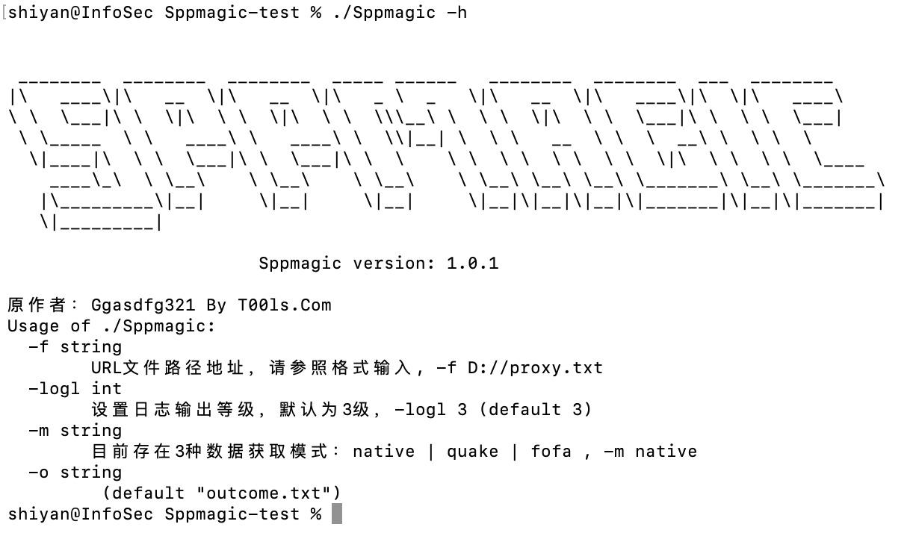
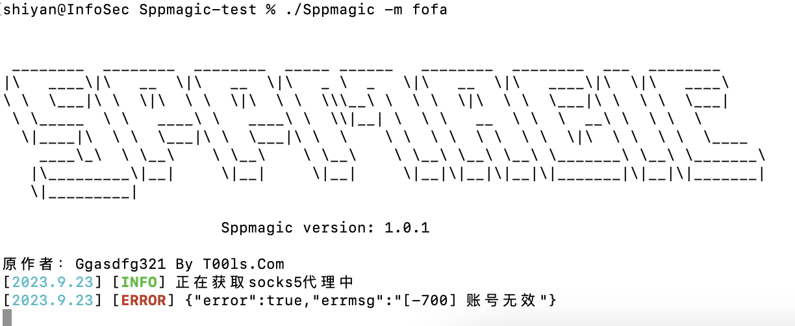
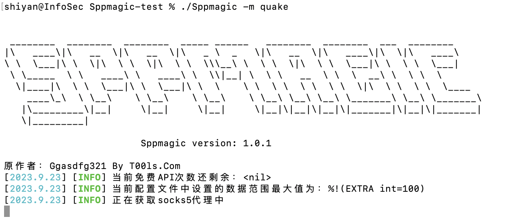

# Sppmagic
一款免费自用的socks5代理小工具，支持从fofa、quake、native三种途径进行socks5代理地址的采集和使用。

## 1. 工具介绍

本工具是 [SmallProxyPool](https://github.com/Ggasdfg321/SmallProxyPool) 的魔改版本，原工具只支持从fofa上持续自动采集2000条免费socks5地址，然后循环代理，由于fofa的API需要高级会员权限才能使用，我自己用起来不太顺手，故进行二次开发，增加了native(本地读取socks5地址)和360quake一次性自动采集的模块，然后进行循环代理。这里我依旧保留了原作者姓名，毕竟核心代理功能模块以及轮询模块的代码我没变动，且整个项目代码中我均保留了我在阅读时批注的相关注解，便于大家阅读，了解学习socks5代理工具编写相关经验。

优化部分：

1. 增加层级显示的log日志输出
2. 增加native本地采集socks5数据功能
3. 增加360quake采集socks5数据功能
4. 增加自动采集socks5数据文件保存
5. 增加存活验证后的socks5代理地址本地保存
6. 项目目录框架重构，便于后期功能拓展和代码阅读
7. 交互命令行增加退出按钮
8. 增加多个拓展复用功能函数
9. 优化主程序函数执行逻辑
10. ...............

## 2. 工具原理

一切以免费自动为前提，工具本身的原理很简单，通过调用fofa或quake的API接口，去查询不需要进行账号验证的socks5代理服务，采集过来后进行存活校验，对可以使用的代理地址放入到轮询代理池中，也可设置使用固定代理地址或最佳代理功能，进行使用。

fofa采集模块：该模块是每隔60秒进行一次API调用查询，把获取到的socks5代理地址放入待验活序列中进行验活后使用

native采集模块：手动读取本地TXT文件中的socks5代理地址，只进行一次存活校验后，便进行代理使用

quake采集模块：该模块为一次性API调用查询，把获取到socks5代理地址放入存活校验后，再进行使用

代理轮询模块：把存活的代理地址放入一个数组中，使用.next()函数进行不断传递每一个代理地址到本地代理服务器中

最佳代理功能：把所有存活的代理地址放入一个数组中，同时放入的还有每个存活代理的响应时间，把响应时间最佳的3个地址放入到top3选择机制中，默认选择第1个最佳代理地址

## 3. 使用说明

下载安装编译：

```go
1、git clone https://github.com/sh1yan/Sppmagic.git
2、go build -ldflags="-s -w " -trimpath main.go
```

常规用法：

``` go
注：手动运行工具第一次后，会在工具同目录下生成一个 config.ini 文件，需要按照个人想法进行配置对应的参数信息
特殊情况：假如出现程序卡顿，失效等情况，可以对工具强制退出后，再次运行时增加个 -logl 4 或者 -logl 5 进行查看具体问题原因
特殊情况示例：./Sppmagic -m fofa -logl 4  或者 ./Sppmagic -m quake -logl 4 等

./Sppmagic -m native -f proxy.txt       (读取本地 proxy.txt 代理地址)
./Sppmagic -m fofa                      (使用 fofa API接口模式进行不断获取socks5代理地址)
./Sppmagic -m quake                     (使用 quake API接口模式进行一次性获取socks5代理地址)

交互式命令：
	show all       // 显示全部可用的代理
	show ip	       // 显示当前使用的代理IP
	use ip:port    // 使用ip:port作为当前代理IP
	use random     // 恢复默认的代理IP
	exit           // 退出程序
```

参数列表：

```go

 ________  ________  ________  _____ ______   ________  ________  ___  ________     
|\   ____\|\   __  \|\   __  \|\   _ \  _   \|\   __  \|\   ____\|\  \|\   ____\    
\ \  \___|\ \  \|\  \ \  \|\  \ \  \\\__\ \  \ \  \|\  \ \  \___|\ \  \ \  \___|    
 \ \_____  \ \   ____\ \   ____\ \  \\|__| \  \ \   __  \ \  \  __\ \  \ \  \       
  \|____|\  \ \  \___|\ \  \___|\ \  \    \ \  \ \  \ \  \ \  \|\  \ \  \ \  \____  
    ____\_\  \ \__\    \ \__\    \ \__\    \ \__\ \__\ \__\ \_______\ \__\ \_______\
   |\_________\|__|     \|__|     \|__|     \|__|\|__|\|__|\|_______|\|__|\|_______|
   \|_________|                                                                     

			Sppmagic version: 1.0.1

Usage of ./Sppmagic_Arm64_20230922:
  -f string
    	URL文件路径地址，请参照格式输入, -f D://proxy.txt
  -logl int
    	设置日志输出等级，默认为3级，-logl 3 (default 3)
  -m string
    	目前存在3种数据获取模式：native | quake | fofa , -m native
  -o string
    	 (default "outcome.txt")

```

## 4. 运行展示
以下运行截图均为代码Debug测试中运行截图,非最终结果样式(2023.09.23)  

`./Sppmagic -h`


`./Sppmagic -m native -f proxy.txt`


`./Sppmagic -m fofa`


`./Sppmagic -m quake`


## 5. 更新概况
[+] 2023.9.23 初版代码工具完工


